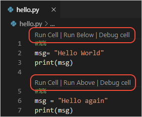

## Introduction to Data Science with Python

## Overview

Location: Accra, Ghana When: July 31 and August 1, 2023

This material focuses on [Polars](https://pola-rs.github.io/polars-book/user-guide/), [Parquet files](https://parquet.apache.org/docs/), [Plotly Express](https://plotly.com/python/plotly-express/), and [Streamlit](https://streamlit.io/) to introduce the data science process.

## Installing the tools

We will need [Visual Studio Code](https://code.visualstudio.com/download) and [Python](https://www.python.org/downloads/) installed for this short course. Each tool has additional packages/extensions that we will need to install as well.


### Visual Studio Code Extensions

You can use [Managing Extensions in Visual Studio Code](https://code.visualstudio.com/docs/editor/extension-marketplace) to learn about how to install extensions. We will use [Python - Visual Studio Marketplace](https://marketplace.visualstudio.com/items?itemName=ms-python.python) extension heavily. [Managing Extensions in Visual Studio Code](https://code.visualstudio.com/docs/editor/extension-marketplace) provides more background on extensions if needed.

#### VS Code Interactive Python Window

An open-source project called [Jupyter](http://jupyter-notebook.readthedocs.io/en/latest/) is the standard method for interactive Python use for data science or scientific computing. However, there are [some issues](https://towardsdatascience.com/5-reasons-why-jupyter-notebooks-suck-4dc201e27086) with its use in a development environment. VS Code provides a way for us to have the best of Python and Jupyter Notebooks with their [Python Interactive Window](https://code.visualstudio.com/docs/python/jupyter-support-py).

VS Code is fairly intelligent in responding to your needs. If you open a `.py` file it should ask pop up a window asking you if you would like prepare your Python experience. You will need to install the [jupyter python package](https://jupyter.readthedocs.io/en/latest/install.html). If VS Code doesn't install it it, you can use `pip` or `pip3` for the interactive Python window to work.

Using the VS Code functionality, you will work with a standard `.py` file instead of the `.ipynb` extension typically used with jupyter notebooks. The Python extension in VS Code will recognize `# %%` as a cell or chunk of python code and add notebook options to ‘Run Cell’ as well as other actions. You can see the code example bellow with the image of the view in VS Code as an example. [Microsoft’s documentation](https://code.visualstudio.com/docs/python/jupyter-support-py) goes into more detail (https://code.visualstudio.com/docs/python/jupyter-support-py).

To make the interactive window use more functional you can `ctrl + ,` or `cmd + ,` on a mac to open the settings. From there you can search **‘Send Selection to Interactive Window’** and make sure the box is checked. Now you will be able to use `shift + return` to send a selected chunk of code or an entire cell.

```python
# %%
msg = "Hello World"
print(msg)

# %%
msg = "Hello again"
print(msg)
```



### Python Packages

#### `pip` overview

*The standard command* - `pip install polars[all] plotly streamlit` is executed in your Terminal, Command Window, or by using the `New Terminal` under `Terminal` in VS Code. If you are using a Mac you most likely will use `pip3 install polars[all] plotly streamlit`. In your interactive Python environment in VS Code (Jupyter server) you can run `!pip install polars[all] plotly streamlit` as explained [here](https://jakevdp.github.io/blog/2017/12/05/installing-python-packages-from-jupyter/#How-to-use-Pip-from-the-Jupyter-Notebook). Finally, you could use the following Python code snippet.

The two commands that can be used in the interactive python window in VS Code to install packages.

```python
!pip install polars[all] plotly streamlit
```

or

```python
import sys
!{sys.executable} -m pip install polars[all] plotly streamlit
```

#### `pip` commands

- `pip install polars[all] plotly streamlit` should install all needed packages.

You could install them individually using the following commands.

- `pip install polars[all]` for [Polars](https://pola-rs.github.io/polars-book/user-guide/installation/)
- `pip install streamlit` for [Streamlit](https://docs.streamlit.io/library/get-started/main-concepts)
- `pip install plotly` for [plotly in Python](https://plotly.com/python/getting-started/)

## Repo Navigation

### `guides` folder

The `guides` folder will allow us to explore these packages if the internet connection is down during our course.

- PDF Files: The pdf files should have most of the commands we will need during the course. The `polars_website.pdf` is a full pdf build of their website guide as of July 2023.
- `streamlit_md` folder: This folder has the markdown files used to build their website guide. It is a little harder to navigate.
- `polars_site` folder: This folder has the fully built website for the polars package as of July 2023. From your OS file explorer open the `index.html` file to see the full site.

### `data` folder

This folder has the data we will be using for the short course. Read more about [the data folder](https://file+.vscode-resource.vscode-cdn.net/Users/hathawayj/git/hathawayj/ghana_datascience/data/readme.md).

### Scripts folder

The scripts folder has the starting scripts for each of the activities we will complete during the short course.

### Markdown links

- [plotly.md](https://file+.vscode-resource.vscode-cdn.net/Users/hathawayj/git/hathawayj/ghana_datascience/plotly.md): links to the primary functions we will use as we create charts with Plotly Express
- [polars.md](https://file+.vscode-resource.vscode-cdn.net/Users/hathawayj/git/hathawayj/ghana_datascience/polars.md): links to the key methods we will leverage for data import and munging.
- [streamlit.md](https://file+.vscode-resource.vscode-cdn.net/Users/hathawayj/git/hathawayj/ghana_datascience/streamlit.md): links to the dashboard functions and concepts we will use with Streamlit

## Slides

The [HTML Slides](https://hathawayj.github.io/ghana_datascience/) and [pdf slides](https://github.com/hathawayj/ghana_datascience/blob/slides/slides.pdf)
